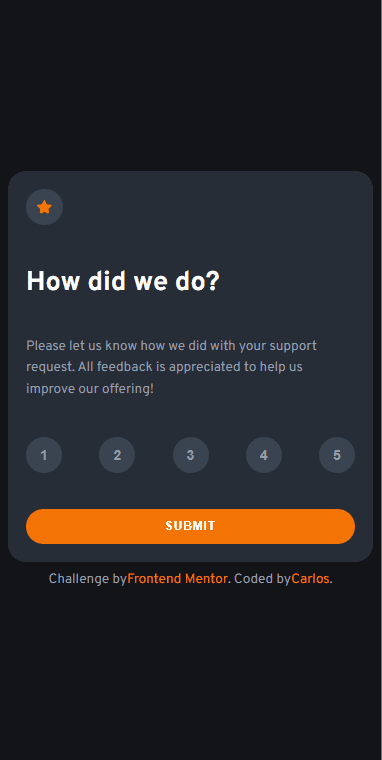
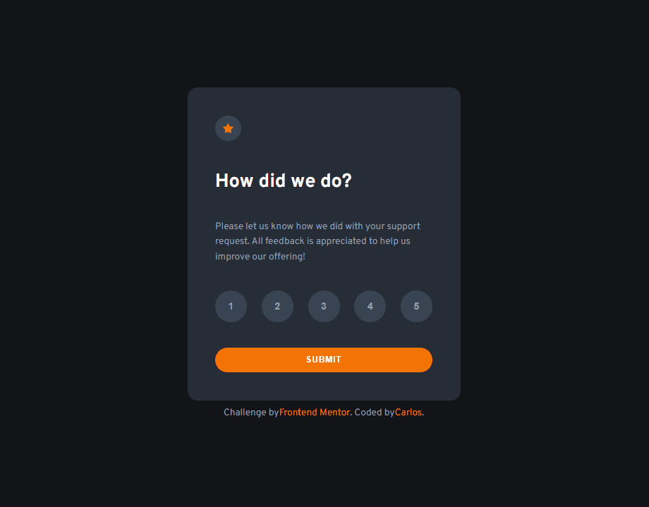

# Frontend Mentor - Interactive rating component

## 🎯 Desafio
Este projeto é uma solução para o desafio do **Frontend Mentor**. O objetivo era desenvolver um <a href="https://www.frontendmentor.io/challenges/interactive-rating-component-koxpeBUmI" target="_blank" rel="noopener noreferrer">**componente interativo de avaliação**</a> que permitisse ao usuário selecionar uma nota e ver uma tela de agradecimento após o envio.

📸 Screenshot
| Versão Mobile | Versão Desktop |
|---------------|----------------|
| | |

## 🔍 Visão Geral
Os usuários devem ser capazes de:
- Visualizar o layout ideal do componente, independentemente do tamanho da tela.
- Ver os estados de hover para todos os elementos interativos.
- Selecionar uma nota numérica de 1 a 5.
- Enviar sua avaliação e visualizar uma tela de agradecimento.
- Voltar para alterar a avaliação, se desejado.

## 🛠️ Tecnologias Utilizadas
- **HTML5** – Estrutura semântica e acessível.
- **CSS3** – Estilização com foco em responsividade, estados de interação e acessibilidade.
- **JavaScript** – Lógica para seleção, envio, alternância entre telas e validação.

## ✨ Funcionalidades
- Seleção dinâmica: O botão selecionado é destacado, e os demais desmarcados automaticamente.
- Validação de envio: O usuário só pode prosseguir após selecionar uma avaliação.
= Tela de agradecimento: Mostra a nota escolhida e permite voltar.
- Responsividade: Funciona bem em diferentes tamanhos de tela.
- Código modular: A lógica JavaScript foi estruturada em funções reutilizáveis para clareza e manutenção.

## 📚 O que aprendi
Durante a construção deste projeto, reforcei os seguintes conceitos:
- Manipulação de DOM com JavaScript Vanilla.
- Criação de componentes reutilizáveis e responsivos.
- Boas práticas de organização de CSS.
- Separação clara entre lógica, estrutura e estilo.

## 🔗 Links
- Site ao vivo: <a href="https://slayer-br.github.io/interactive-rating/" target="_blank" rel="noopener noreferrer">Interactive Rating Component</a>
- URL da solução: <a href="https://github.com/slayer-br/interactive-rating" target="_blank" rel="noopener noreferrer">Interactive Rating Component</a>

## 👨‍💻 Autor
- GitHub - <a href="https://github.com/slayer-br" target="_blank" rel="noopener noreferrer">@slayer-br</a>
- Frontend Mentor - <a href="https://www.frontendmentor.io/profile/slayer-br" target="_blank" rel="noopener noreferrer">@slayer-br</a>

## 📝 Licença
Este projeto está sob a licença [MIT](LICENSE), sinta-se livre para usar e modificar.

## 🙌 Agradecimentos
Desafio proposto por **Frontend Mentor**.